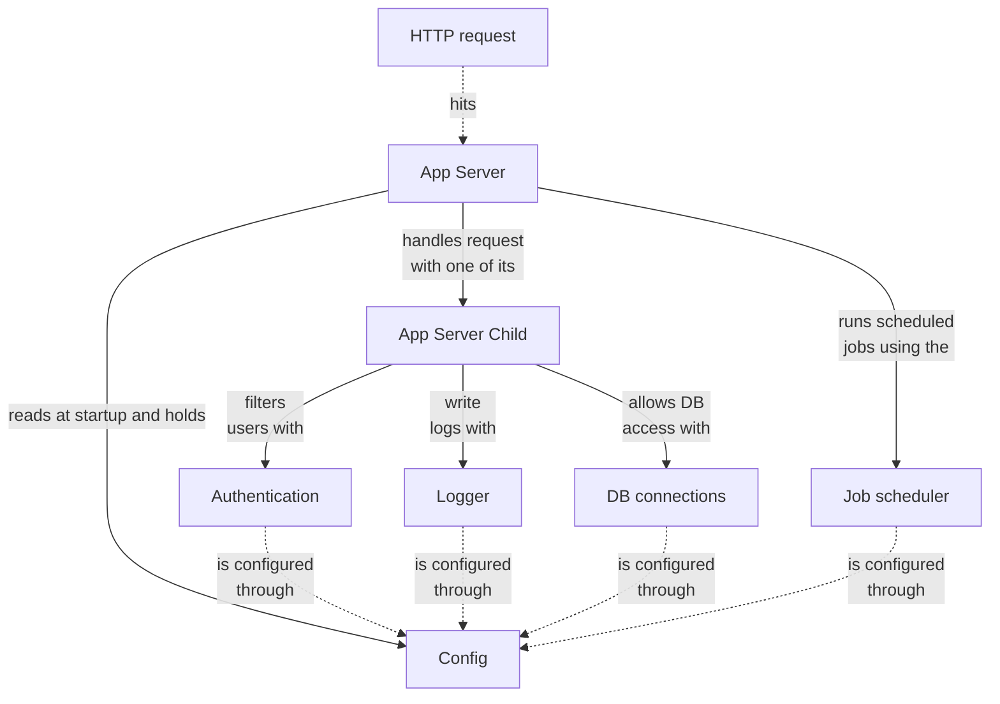

# Why Vostok?

## Why Go, in the first place?

Vostok is born from the desire to use Go, and this language's amazing features:

- Light yet powerful **concurrency** handling
- C-grade **performance**
- Reliable and performant **compiled binaries**, no virtual machines
- **Proven** robustness: used in Docker, Kubernetes, Logstash, Metric Beats, AWS, Paypal, OVH, etc
- Syntax **simplicity**: 25 keywords
- The ecosystem is **growing**, like NodeJS
- **Multi-purposes**: from system scripts to business apps
- With many native **functionalities**: log, http, crypto, etc

## Why another Go framework?

::: danger TODO
Update the links below
:::

Vostok was first written to create programs with a certain idea on how to manage a [pooled HTTP server](../core/features.md), [configure](../core/features.md) it, having it write to [log](../core/features.md) files, and connect to [databases](../core/features.md).

The **core** of Vostok provides other [features](../core/features.md), such as [authentication](../core/features.md) and a [job scheduler](../core/features.md).

::: tip That's why
With Vostok, developers benefit from these basic capabilities, don't have to develop or import them from various places, and work in a **homogenous** environment.
:::

